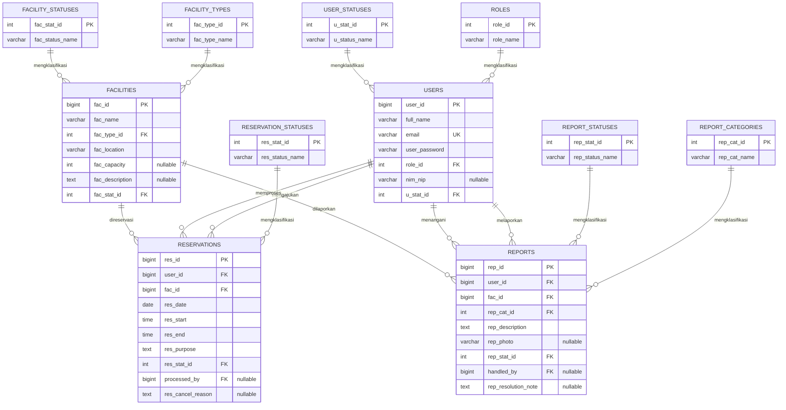
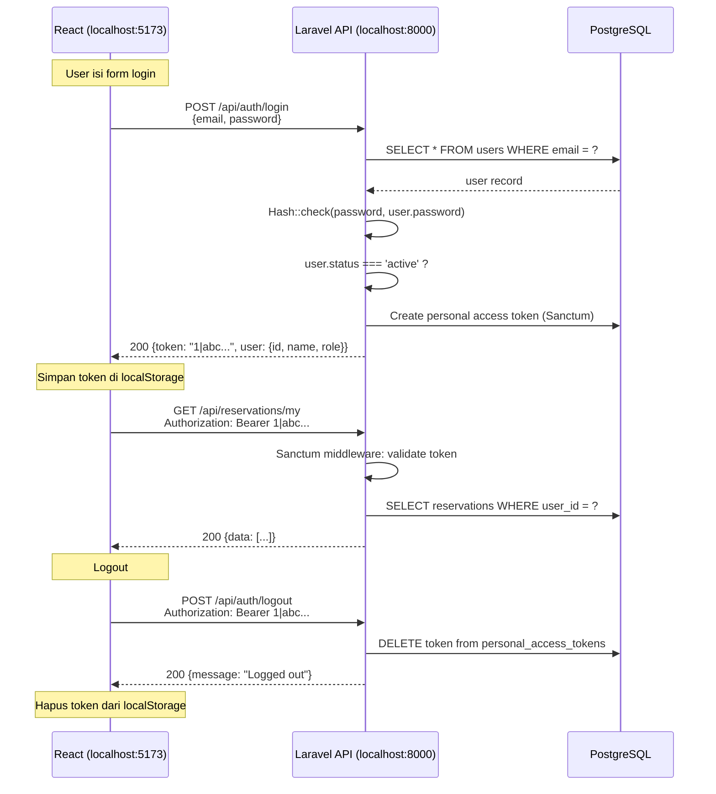
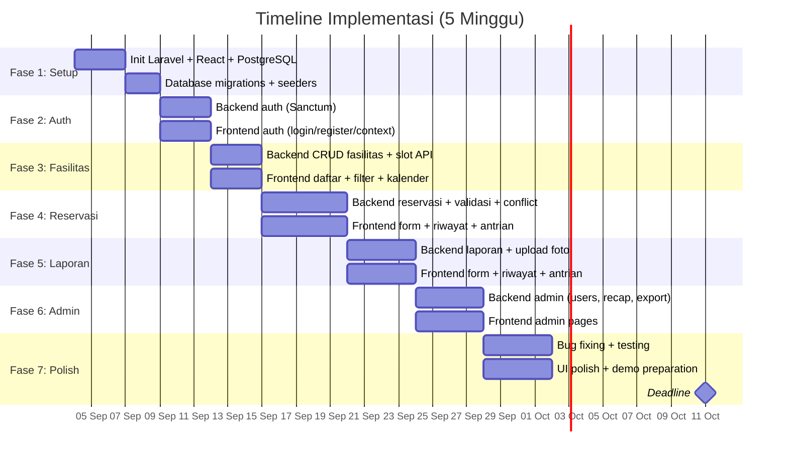

# Implementation Plan — Sistem Reservasi & Pelaporan Fasilitas Kampus

## Ringkasan Proyek

Aplikasi web untuk mengelola penggunaan fasilitas kampus (ruang kelas, aula, laboratorium, alat, lapangan). Pengguna dapat mengecek ketersediaan, mengajukan reservasi, dan melaporkan kerusakan. Petugas dan admin memproses kedua alur secara terpusat.

**Tech Stack Final:**
| Layer | Teknologi |
|-------|-----------|
| Frontend | React 18 (Vite) + React Router v6 + Bootstrap 5 + Axios |
| Backend | Laravel 11 (REST API mode) |
| Auth | Laravel Sanctum (token-based) |
| Database | PostgreSQL 16 |
| Dev Environment | Laragon (PHP 8.2+, PostgreSQL, Composer, Node.js) |
| Export | Laravel Excel (maatwebsite) + DomPDF (barryvdh) |
| Kalender | FullCalendar React |

---

## Proposed Changes

### 1. Struktur Folder Proyek

```
code/
│
├── backend/                                # Laravel 11 REST API
│   ├── app/
│   │   ├── Http/
│   │   │   ├── Controllers/
│   │   │   │   ├── Auth/
│   │   │   │   │   └── AuthController.php          # Register, login, logout, me
│   │   │   │   ├── FacilityController.php           # CRUD fasilitas + slot
│   │   │   │   ├── ReservationController.php        # CRUD reservasi + approve/reject
│   │   │   │   ├── ReportController.php             # CRUD laporan kerusakan
│   │   │   │   └── Admin/
│   │   │   │       ├── UserController.php           # Kelola akun, verifikasi
│   │   │   │       └── RecapController.php          # Rekap & export
│   │   │   │
│   │   │   ├── Middleware/
│   │   │   │   ├── RoleMiddleware.php               # Cek role dari token
│   │   │   │   └── EnsureUserIsActive.php           # Cek status user = active
│   │   │   │
│   │   │   └── Requests/                            # Form Request Validation
│   │   │       ├── StoreReservationRequest.php      # Validasi slot 30 menit (server)
│   │   │       ├── StoreReportRequest.php           # Validasi laporan + upload foto
│   │   │       ├── StoreFacilityRequest.php
│   │   │       └── RegisterRequest.php
│   │   │
│   │   ├── Models/
│   │   │   ├── User.php
│   │   │   ├── Facility.php
│   │   │   ├── Reservation.php
│   │   │   └── Report.php
│   │   │
│   │   ├── Exports/                                 # Laravel Excel exports
│   │   │   └── RecapExport.php
│   │   │
│   │   └── Services/                                # Business logic layer
│   │       ├── ReservationService.php               # Conflict detection, slot validation
│   │       └── ReportService.php                    # Status transition logic
│   │
│   ├── config/
│   │   ├── cors.php                                 # CORS untuk React
│   │   ├── sanctum.php                              # Sanctum config
│   │   └── ...
│   │
│   ├── database/
│   │   ├── migrations/
│   │   │   ├── 0001_01_01_000000_create_users_table.php
│   │   │   ├── 0001_01_01_000001_create_facilities_table.php
│   │   │   ├── 0001_01_01_000002_create_reservations_table.php
│   │   │   └── 0001_01_01_000003_create_reports_table.php
│   │   │
│   │   ├── seeders/
│   │   │   ├── DatabaseSeeder.php
│   │   │   ├── UserSeeder.php                       # Admin, petugas, pengguna demo
│   │   │   └── FacilitySeeder.php                   # Data fasilitas kampus
│   │   │
│   │   └── factories/
│   │       ├── UserFactory.php
│   │       ├── FacilityFactory.php
│   │       ├── ReservationFactory.php
│   │       └── ReportFactory.php
│   │
│   ├── routes/
│   │   └── api.php                                  # Semua route API
│   │
│   ├── storage/
│   │   └── app/public/reports/                      # Upload foto laporan
│   │
│   ├── .env
│   ├── .env.example
│   └── composer.json
│
├── frontend/                                # React 18 SPA (Vite)
│   ├── public/
│   │   └── favicon.ico
│   │
│   ├── src/
│   │   ├── main.jsx                                 # Entry point
│   │   ├── App.jsx                                  # Root component + Router
│   │   │
│   │   ├── api/                                     # Axios API layer
│   │   │   ├── axios.js                             # Instance + interceptor token
│   │   │   ├── auth.js                              # Login, register, logout, getMe
│   │   │   ├── facilities.js                        # CRUD fasilitas + get slots
│   │   │   ├── reservations.js                      # CRUD reservasi
│   │   │   ├── reports.js                           # CRUD laporan
│   │   │   └── admin.js                             # User management, recap, export
│   │   │
│   │   ├── contexts/
│   │   │   └── AuthContext.jsx                      # Auth state global (user, token)
│   │   │
│   │   ├── hooks/
│   │   │   ├── useAuth.js                           # Shortcut ke AuthContext
│   │   │   └── useFetch.js                          # Custom hook GET + loading/error
│   │   │
│   │   ├── components/
│   │   │   ├── layout/
│   │   │   │   ├── AppLayout.jsx                    # Wrapper: Navbar + Sidebar + Content
│   │   │   │   ├── Navbar.jsx                       # Top navbar (logo, user menu)
│   │   │   │   ├── Sidebar.jsx                      # Side menu (role-based)
│   │   │   │   └── ProtectedRoute.jsx               # Guard: cek auth + role
│   │   │   │
│   │   │   ├── facilities/
│   │   │   │   ├── FacilityCard.jsx                 # Card tampilan fasilitas
│   │   │   │   ├── FacilityFilter.jsx               # Filter tipe/lokasi/kapasitas
│   │   │   │   ├── SlotCalendar.jsx                 # FullCalendar slot 30 menit
│   │   │   │   └── FacilityForm.jsx                 # Form tambah/edit (admin)
│   │   │   │
│   │   │   ├── reservations/
│   │   │   │   ├── ReservationForm.jsx              # Form ajukan reservasi
│   │   │   │   ├── ReservationTable.jsx             # Tabel riwayat reservasi
│   │   │   │   └── ReservationQueue.jsx             # Tabel antrian (petugas)
│   │   │   │
│   │   │   ├── reports/
│   │   │   │   ├── ReportForm.jsx                   # Form lapor + upload foto
│   │   │   │   ├── ReportTable.jsx                  # Tabel riwayat laporan
│   │   │   │   └── ReportQueue.jsx                  # Tabel antrian (petugas)
│   │   │   │
│   │   │   └── common/
│   │   │       ├── StatusBadge.jsx                  # Badge warna per status
│   │   │       ├── ConfirmModal.jsx                 # Modal konfirmasi aksi
│   │   │       ├── Pagination.jsx                   # Navigasi halaman
│   │   │       ├── LoadingSpinner.jsx               # Spinner loading
│   │   │       └── Alert.jsx                        # Toast/alert notifikasi
│   │   │
│   │   ├── pages/
│   │   │   ├── public/
│   │   │   │   ├── HomePage.jsx                     # Landing: daftar fasilitas publik
│   │   │   │   ├── FacilityDetailPage.jsx           # Detail + kalender slot
│   │   │   │   ├── LoginPage.jsx                    # Form login
│   │   │   │   └── RegisterPage.jsx                 # Form registrasi
│   │   │   │
│   │   │   ├── user/
│   │   │   │   ├── DashboardPage.jsx                # Ringkasan: reservasi & laporan saya
│   │   │   │   ├── MyReservationsPage.jsx           # Riwayat + detail reservasi
│   │   │   │   ├── NewReservationPage.jsx           # Pilih fasilitas → form reservasi
│   │   │   │   ├── MyReportsPage.jsx                # Riwayat + status laporan
│   │   │   │   └── NewReportPage.jsx                # Form laporan kerusakan
│   │   │   │
│   │   │   ├── officer/
│   │   │   │   ├── OfficerDashboardPage.jsx         # Ringkasan antrian
│   │   │   │   ├── ReservationQueuePage.jsx         # Antrian reservasi pending
│   │   │   │   └── ReportQueuePage.jsx              # Antrian laporan baru/diproses
│   │   │   │
│   │   │   └── admin/
│   │   │       ├── AdminDashboardPage.jsx           # Statistik keseluruhan
│   │   │       ├── ManageFacilitiesPage.jsx         # CRUD fasilitas
│   │   │       ├── ManageUsersPage.jsx              # Buat akun petugas/pengguna
│   │   │       ├── VerifyUsersPage.jsx              # Verifikasi registrasi pending
│   │   │       └── RecapPage.jsx                    # Tabel rekap + tombol export
│   │   │
│   │   ├── utils/
│   │   │   ├── slotValidation.js                    # Validasi slot 30 menit (client)
│   │   │   ├── constants.js                         # Jam operasional, enum status
│   │   │   └── formatters.js                        # Format tanggal, waktu, rupiah
│   │   │
│   │   └── styles/
│   │       └── custom.css                           # Override & custom styles
│   │
│   ├── index.html
│   ├── vite.config.js
│   └── package.json
│
├── .gitignore
└── README.md
```

---

### 2. Skema Database (PostgreSQL)

#### Tabel `roles`

| Kolom | Tipe | Constraint | Keterangan |
|-------|------|-----------|-----------|
| `role_id` | `INT` | PK, IDENTITY | |
| `role_name` | `VARCHAR(20)` | NOT NULL, UNIQUE | `pengguna` / `petugas` / `admin` |

#### Tabel `user_statuses`

| Kolom | Tipe | Constraint | Keterangan |
|-------|------|-----------|-----------|
| `u_stat_id` | `INT` | PK, IDENTITY | |
| `u_status_name` | `VARCHAR(30)` | NOT NULL, UNIQUE | `pending` / `active` / `rejected` |

#### Tabel `facility_types`

| Kolom | Tipe | Constraint | Keterangan |
|-------|------|-----------|-----------|
| `fac_type_id` | `INT` | PK, IDENTITY | |
| `fac_type_name` | `VARCHAR(30)` | NOT NULL, UNIQUE | `ruang_kelas` / `aula` / `laboratorium` / `alat` / `lapangan` |

#### Tabel `facility_statuses`

| Kolom | Tipe | Constraint | Keterangan |
|-------|------|-----------|-----------|
| `fac_stat_id` | `INT` | PK, IDENTITY | |
| `fac_status_name` | `VARCHAR(20)` | NOT NULL, UNIQUE | `aktif` / `dalam_perbaikan` / `nonaktif` |

#### Tabel `reservation_statuses`

| Kolom | Tipe | Constraint | Keterangan |
|-------|------|-----------|-----------|
| `res_stat_id` | `INT` | PK, IDENTITY | |
| `res_status_name` | `VARCHAR(20)` | NOT NULL, UNIQUE | `pending` / `approved` / `rejected` / `cancelled` |

#### Tabel `report_categories`

| Kolom | Tipe | Constraint | Keterangan |
|-------|------|-----------|-----------|
| `rep_cat_id` | `INT` | PK, IDENTITY | |
| `rep_cat_name` | `VARCHAR(30)` | NOT NULL, UNIQUE | `kerusakan_ringan` / `kerusakan_berat` / `kebersihan` / `keamanan` / `lainnya` |

#### Tabel `report_statuses`

| Kolom | Tipe | Constraint | Keterangan |
|-------|------|-----------|-----------|
| `rep_stat_id` | `INT` | PK, IDENTITY | |
| `rep_status_name` | `VARCHAR(20)` | NOT NULL, UNIQUE | `baru` / `diproses` / `selesai` / `ditolak` |

#### Tabel `users`

| Kolom | Tipe | Constraint | Keterangan |
|-------|------|-----------|-----------|
| `user_id` | `BIGINT` | PK, IDENTITY | |
| `full_name` | `VARCHAR(100)` | NOT NULL | Nama lengkap |
| `email` | `VARCHAR(150)` | NOT NULL, UNIQUE | Untuk login |
| `user_password` | `VARCHAR(255)` | NOT NULL | Bcrypt hash |
| `role_id` | `INT` | FK → roles.role_id, NOT NULL, DEFAULT 1 | Lihat tabel `roles` |
| `nim_nip` | `VARCHAR(30)` | NULLABLE | NIM mahasiswa / NIP dosen-staf |
| `u_stat_id` | `INT` | FK → user_statuses.u_stat_id, NOT NULL, DEFAULT 1 | Lihat tabel `user_statuses` |
| `created_at` | `TIMESTAMP` | DEFAULT now() | |
| `updated_at` | `TIMESTAMP` | DEFAULT now() | |

> [!NOTE]
> `role` dan `status` sebelumnya berupa `VARCHAR` dengan validasi di Laravel. Sekarang dipisah menjadi tabel lookup (`roles`, `user_statuses`) yang direferensikan lewat FK, agar integritas nilai dijaga langsung oleh database (mencegah typo / nilai tidak valid).

---

#### Tabel `facilities`

| Kolom | Tipe | Constraint | Keterangan |
|-------|------|-----------|-----------|
| `fac_id` | `BIGINT` | PK, IDENTITY | |
| `fac_name` | `VARCHAR(150)` | NOT NULL | Nama fasilitas |
| `fac_type_id` | `INT` | FK → facility_types.fac_type_id, NOT NULL | Lihat tabel `facility_types` |
| `fac_location` | `VARCHAR(200)` | NOT NULL | Gedung / lantai / area |
| `fac_capacity` | `INTEGER` | NULLABLE | Kapasitas orang (null untuk alat) |
| `fac_description` | `TEXT` | NULLABLE | Deskripsi fasilitas |
| `fac_stat_id` | `INT` | FK → facility_statuses.fac_stat_id, NOT NULL, DEFAULT 1 | Lihat tabel `facility_statuses` |
| `fac_image` | `VARCHAR(255)` | NULLABLE | Path gambar fasilitas |
| `created_at` | `TIMESTAMP` | DEFAULT now() | |
| `updated_at` | `TIMESTAMP` | DEFAULT now() | |

**Index:** `fac_type_id`, `fac_stat_id`, `fac_location`
---

#### Tabel `reservations`

| Kolom | Tipe | Constraint | Keterangan |
|-------|------|-----------|-----------|
| `id` | `BIGINT` | PK, AUTO INCREMENT | |
| `user_id` | `BIGINT` | FK → users.id, NOT NULL | Pemohon |
| `facility_id` | `BIGINT` | FK → facilities.id, NOT NULL | Fasilitas yang dipesan |
| `reservation_date` | `DATE` | NOT NULL | Tanggal reservasi |
| `start_time` | `TIME` | NOT NULL | Jam mulai (kelipatan 30 menit, ≥ 07:00) |
| `end_time` | `TIME` | NOT NULL | Jam selesai (kelipatan 30 menit, ≤ 20:00) |
| `purpose` | `TEXT` | NOT NULL | Tujuan penggunaan |
| `status` | `VARCHAR(20)` | NOT NULL, DEFAULT 'pending' | `pending` / `approved` / `rejected` / `cancelled` |
| `processed_by` | `BIGINT` | FK → users.id, NULLABLE | Petugas yang memproses |
| `cancel_reason` | `TEXT` | NULLABLE | Alasan pembatalan darurat |
| `created_at` | `TIMESTAMP` | | |
| `updated_at` | `TIMESTAMP` | | |

**Index:** `(facility_id, reservation_date)` composite, `user_id`, `status`
**CHECK Constraint:**
```sql
CHECK (start_time >= '07:00' AND end_time <= '20:00' AND start_time < end_time)
CHECK (EXTRACT(MINUTE FROM start_time) IN (0, 30) AND EXTRACT(MINUTE FROM end_time) IN (0, 30))
```

---

#### Tabel `reports`

| Kolom | Tipe | Constraint | Keterangan |
|-------|------|-----------|-----------|
| `rep_id` | `BIGINT` | PK, IDENTITY | |
| `user_id` | `BIGINT` | FK → users.user_id, NOT NULL | Pelapor |
| `fac_id` | `BIGINT` | FK → facilities.fac_id, NOT NULL | Fasilitas yang dilaporkan |
| `rep_cat_id` | `INT` | FK → report_categories.rep_cat_id, NOT NULL | Lihat tabel `report_categories` |
| `rep_description` | `TEXT` | NOT NULL | Deskripsi masalah |
| `rep_photo` | `VARCHAR(255)` | NULLABLE | Path foto (relative) |
| `rep_stat_id` | `INT` | FK → report_statuses.rep_stat_id, NOT NULL, DEFAULT 1 | Lihat tabel `report_statuses` |
| `handled_by` | `BIGINT` | FK → users.user_id, NULLABLE | Petugas yang menangani |
| `rep_resolution_note` | `TEXT` | NULLABLE | Catatan resolusi |
| `created_at` | `TIMESTAMP` | DEFAULT now() | |
| `updated_at` | `TIMESTAMP` | DEFAULT now() | |

**Index:** `fac_id`, `user_id`, `rep_stat_id`
---

#### Entity Relationship Diagram



---

### 3. API Endpoints

#### Auth
| Method | Endpoint | Akses | Deskripsi |
|--------|----------|-------|-----------|
| `POST` | `/api/auth/register` | Public | Registrasi → status `pending` |
| `POST` | `/api/auth/login` | Public | Login → return Sanctum token |
| `POST` | `/api/auth/logout` | Auth | Revoke token |
| `GET` | `/api/auth/me` | Auth | Profil user yang sedang login |

#### Facilities
| Method | Endpoint | Akses | Deskripsi | User Story |
|--------|----------|-------|-----------|-----------|
| `GET` | `/api/facilities` | Public | Daftar + filter (type, location, capacity) | US#1, US#2 |
| `GET` | `/api/facilities/{id}` | Public | Detail fasilitas | US#1 |
| `GET` | `/api/facilities/{id}/slots?date=` | Public | Slot tersedia/tidak per tanggal | US#1 |
| `POST` | `/api/facilities` | Admin | Tambah fasilitas baru | US#16 |
| `PUT` | `/api/facilities/{id}` | Admin | Edit fasilitas | US#16 |
| `PATCH` | `/api/facilities/{id}/status` | Petugas, Admin | Ubah status (aktif/perbaikan/nonaktif) | US#12, US#16 |

#### Reservations
| Method | Endpoint | Akses | Deskripsi | User Story |
|--------|----------|-------|-----------|-----------|
| `POST` | `/api/reservations` | Pengguna | Ajukan reservasi | US#3 |
| `GET` | `/api/reservations/my` | Pengguna | Riwayat reservasi sendiri | US#5 |
| `GET` | `/api/reservations/{id}` | Pengguna, Petugas | Detail reservasi | US#5 |
| `PATCH` | `/api/reservations/{id}/cancel` | Pengguna | Batalkan milik sendiri | US#4 |
| `GET` | `/api/reservations/queue` | Petugas | Antrian pending | US#8 |
| `PATCH` | `/api/reservations/{id}/approve` | Petugas | Setujui (cek bentrok) | US#9 |
| `PATCH` | `/api/reservations/{id}/reject` | Petugas | Tolak | US#9 |
| `PATCH` | `/api/reservations/{id}/force-cancel` | Petugas | Batalkan paksa + alasan | US#10 |

#### Reports
| Method | Endpoint | Akses | Deskripsi | User Story |
|--------|----------|-------|-----------|-----------|
| `POST` | `/api/reports` | Pengguna | Buat laporan (multipart/foto) | US#6 |
| `GET` | `/api/reports/my` | Pengguna | Riwayat laporan sendiri | US#7 |
| `GET` | `/api/reports/queue` | Petugas | Antrian laporan | US#8 |
| `PATCH` | `/api/reports/{id}/status` | Petugas | Ubah status + catatan resolusi | US#11 |

#### Admin
| Method | Endpoint | Akses | Deskripsi | User Story |
|--------|----------|-------|-----------|-----------|
| `GET` | `/api/admin/users` | Admin | Daftar semua user | US#13–15 |
| `POST` | `/api/admin/users` | Admin | Buat akun langsung (petugas/pengguna) | US#13, US#14 |
| `PATCH` | `/api/admin/users/{id}/verify` | Admin | Verifikasi/tolak akun pending | US#15 |
| `GET` | `/api/admin/recap` | Admin | Data rekap okupansi & kerusakan | US#17 |
| `GET` | `/api/admin/recap/export?format=csv\|xlsx\|pdf` | Admin | Download file export | US#17 |

---

### 4. React Routing Map

```jsx
// App.jsx — Routing Structure

<Routes>
  {/* ==================== PUBLIC ==================== */}
  <Route path="/" element={<HomePage />} />
  <Route path="/facilities/:id" element={<FacilityDetailPage />} />
  <Route path="/login" element={<LoginPage />} />
  <Route path="/register" element={<RegisterPage />} />

  {/* ==================== PENGGUNA ==================== */}
  <Route element={<ProtectedRoute roles={['pengguna','petugas','admin']} />}>
    <Route element={<AppLayout />}>
      <Route path="/dashboard" element={<DashboardPage />} />
      <Route path="/reservations" element={<MyReservationsPage />} />
      <Route path="/reservations/new" element={<NewReservationPage />} />
      <Route path="/reports" element={<MyReportsPage />} />
      <Route path="/reports/new" element={<NewReportPage />} />
    </Route>
  </Route>

  {/* ==================== PETUGAS ==================== */}
  <Route element={<ProtectedRoute roles={['petugas','admin']} />}>
    <Route element={<AppLayout />}>
      <Route path="/officer" element={<OfficerDashboardPage />} />
      <Route path="/officer/reservations" element={<ReservationQueuePage />} />
      <Route path="/officer/reports" element={<ReportQueuePage />} />
    </Route>
  </Route>

  {/* ==================== ADMIN ==================== */}
  <Route element={<ProtectedRoute roles={['admin']} />}>
    <Route element={<AppLayout />}>
      <Route path="/admin" element={<AdminDashboardPage />} />
      <Route path="/admin/facilities" element={<ManageFacilitiesPage />} />
      <Route path="/admin/users" element={<ManageUsersPage />} />
      <Route path="/admin/verify" element={<VerifyUsersPage />} />
      <Route path="/admin/recap" element={<RecapPage />} />
    </Route>
  </Route>
</Routes>
```

---

### 5. Validasi Slot Waktu (2 Lapis)

#### Lapis 1 — Client-Side (React)

```javascript
// frontend/src/utils/slotValidation.js

export function validateSlot(startTime, endTime) {
  const errors = [];
  const [sH, sM] = startTime.split(':').map(Number);
  const [eH, eM] = endTime.split(':').map(Number);
  const startMin = sH * 60 + sM;
  const endMin   = eH * 60 + eM;

  if (sH < 7 || eH > 20 || (eH === 20 && eM > 0))
    errors.push('Waktu harus dalam jam operasional (07:00–20:00)');
  if (sM % 30 !== 0 || eM % 30 !== 0)
    errors.push('Waktu harus kelipatan 30 menit');
  if (startMin >= endMin)
    errors.push('Waktu mulai harus sebelum waktu selesai');

  return errors;
}
```

#### Lapis 2 — Server-Side (Laravel Form Request)

```php
// backend/app/Http/Requests/StoreReservationRequest.php

public function rules(): array
{
    return [
        'facility_id'      => ['required', 'exists:facilities,id'],
        'reservation_date'  => ['required', 'date', 'after_or_equal:today'],
        'start_time'        => ['required', 'date_format:H:i', new ValidSlot],
        'end_time'          => ['required', 'date_format:H:i', 'after:start_time', new ValidSlot],
        'purpose'           => ['required', 'string', 'min:10'],
    ];
}
```

```php
// Custom Rule: ValidSlot
public function passes($attribute, $value): bool
{
    $time = Carbon::createFromFormat('H:i', $value);
    $hour = $time->hour;
    $minute = $time->minute;

    // Jam operasional 07:00–20:00 & kelipatan 30 menit
    return $hour >= 7 && $hour <= 20
        && in_array($minute, [0, 30])
        && !($hour === 20 && $minute === 30);
}
```

#### Conflict Detection (Service Layer)

```php
// backend/app/Services/ReservationService.php

public function hasConflict(int $facilityId, string $date, string $start, string $end, ?int $excludeId = null): bool
{
    return Reservation::where('facility_id', $facilityId)
        ->where('reservation_date', $date)
        ->where('status', 'approved')
        ->where('start_time', '<', $end)
        ->where('end_time', '>', $start)
        ->when($excludeId, fn($q) => $q->where('id', '!=', $excludeId))
        ->exists();
}
```

> [!CAUTION]
> Sesuai ketentuan soal, validasi slot **wajib di server-side**, bukan hanya di tampilan kalender. Client-side validation hanya untuk memberikan feedback cepat ke pengguna.

---

### 6. Autentikasi (Laravel Sanctum)



---

### 7. Seed Data untuk Demo & Presentasi

| Role | Email | Password | Status |
|------|-------|----------|--------|
| Admin | `admin@kampus.ac.id` | `admin123` | active |
| Petugas | `petugas1@kampus.ac.id` | `petugas123` | active |
| Pengguna (mahasiswa) | `mhs1@kampus.ac.id` | `mhs123` | active |
| Pengguna (dosen) | `dosen1@kampus.ac.id` | `dosen123` | active |
| Pengguna (pending) | `mhs.baru@kampus.ac.id` | `mhs123` | pending |

Fasilitas demo:
| Nama | Tipe | Lokasi | Kapasitas |
|------|------|--------|-----------|
| Ruang A101 | ruang_kelas | Gedung A Lt.1 | 40 |
| Aula Utama | aula | Gedung Rektorat | 500 |
| Lab Komputer 1 | laboratorium | Gedung B Lt.2 | 30 |
| Lapangan Futsal | lapangan | Area Olahraga | 20 |
| Proyektor Portable #1 | alat | Gudang Fasilitas | 1 |

---

### 8. Mapping Lengkap: User Story → Implementasi

| US# | User Story | React Page | React Component | API Endpoint | Laravel Controller Method |
|-----|-----------|-----------|----------------|-------------|--------------------------|
| 1 | Lihat daftar fasilitas + ketersediaan slot | `HomePage`, `FacilityDetailPage` | `FacilityCard`, `SlotCalendar` | `GET /api/facilities`, `GET /api/facilities/{id}/slots` | `FacilityController@index`, `@slots` |
| 2 | Cari fasilitas (tipe/lokasi/kapasitas) | `HomePage` | `FacilityFilter` | `GET /api/facilities?type=&location=&capacity=` | `FacilityController@index` |
| 3 | Ajukan reservasi | `NewReservationPage` | `ReservationForm`, `SlotCalendar` | `POST /api/reservations` | `ReservationController@store` |
| 4 | Batalkan reservasi sendiri | `MyReservationsPage` | `ConfirmModal` | `PATCH /api/reservations/{id}/cancel` | `ReservationController@cancel` |
| 5 | Lihat riwayat & detail reservasi | `MyReservationsPage` | `ReservationTable` | `GET /api/reservations/my`, `GET /api/reservations/{id}` | `ReservationController@myList`, `@show` |
| 6 | Laporkan kerusakan (kategori, deskripsi, foto) | `NewReportPage` | `ReportForm` | `POST /api/reports` | `ReportController@store` |
| 7 | Lihat status laporan | `MyReportsPage` | `ReportTable` | `GET /api/reports/my` | `ReportController@myList` |
| 8 | Dashboard antrian (petugas) | `OfficerDashboardPage` | `ReservationQueue`, `ReportQueue` | `GET /api/reservations/queue`, `GET /api/reports/queue` | `ReservationController@queue`, `ReportController@queue` |
| 9 | Approve/reject reservasi (cek bentrok) | `ReservationQueuePage` | `ReservationQueue`, `ConfirmModal` | `PATCH /api/reservations/{id}/approve\|reject` | `ReservationController@approve`, `@reject` |
| 10 | Force-cancel + alasan | `ReservationQueuePage` | `ConfirmModal` (with textarea) | `PATCH /api/reservations/{id}/force-cancel` | `ReservationController@forceCancel` |
| 11 | Ubah status laporan + catatan resolusi | `ReportQueuePage` | `ReportQueue`, `ConfirmModal` | `PATCH /api/reports/{id}/status` | `ReportController@updateStatus` |
| 12 | Tandai fasilitas 'dalam perbaikan' | `ReportQueuePage` | toggle button | `PATCH /api/facilities/{id}/status` | `FacilityController@updateStatus` |
| 13 | Daftarkan akun petugas | `ManageUsersPage` | form (role=petugas) | `POST /api/admin/users` | `Admin\UserController@store` |
| 14 | Daftarkan akun pengguna | `ManageUsersPage` | form (role=pengguna) | `POST /api/admin/users` | `Admin\UserController@store` |
| 15 | Verifikasi/tolak akun pending | `VerifyUsersPage` | approve/reject buttons | `PATCH /api/admin/users/{id}/verify` | `Admin\UserController@verify` |
| 16 | Kelola fasilitas (CRUD) | `ManageFacilitiesPage` | `FacilityForm` | `POST/PUT /api/facilities` | `FacilityController@store`, `@update` |
| 17 | Rekap & export (CSV/Excel/PDF) | `RecapPage` | tabel + export buttons | `GET /api/admin/recap`, `GET /api/admin/recap/export` | `Admin\RecapController@index`, `@export` |

---

### 9. Urutan Implementasi (7 Fase — 5 Minggu)



| Fase | Minggu | Backend | Frontend |
|------|--------|---------|----------|
| **1. Setup** | M1 (4–6 Sep) | `composer create-project`, migrations, seeders, CORS, PostgreSQL | `npm create vite`, install deps, Axios instance, folder structure |
| **2. Auth** | M1 (7–10 Sep) | AuthController, Sanctum install, RoleMiddleware | LoginPage, RegisterPage, AuthContext, ProtectedRoute |
| **3. Fasilitas** | M2 (11–14 Sep) | FacilityController (CRUD + slots query) | HomePage, FacilityDetailPage, SlotCalendar, FacilityFilter |
| **4. Reservasi** | M2–M3 (15–20 Sep) | ReservationController, StoreReservationRequest, ReservationService (conflict) | NewReservationPage, MyReservationsPage, ReservationQueue |
| **5. Laporan** | M3 (21–25 Sep) | ReportController, upload foto (storage link) | NewReportPage, MyReportsPage, ReportQueue |
| **6. Admin** | M4 (26–30 Sep) | Admin\UserController, Admin\RecapController, Export (Excel/PDF) | ManageFacilitiesPage, ManageUsersPage, VerifyUsersPage, RecapPage |
| **7. Polish** | M5 (1–10 Okt) | Bug fix, edge cases, seed data final | UI polish, responsiveness, persiapan presentasi |

---

### 10. Pembagian Kerja Tim (4–5 Orang)

| Anggota | Fokus | Tanggung Jawab Utama |
|---------|-------|---------------------|
| **A** | Backend Core | Setup Laravel, migrations, Sanctum auth, middleware, CORS, database seeder |
| **B** | Backend Fitur | ReservationController, ReportController, FacilityController, validasi slot, conflict detection, upload foto |
| **C** | Frontend Core | Setup React+Vite, React Router, AuthContext, AppLayout (Navbar, Sidebar), ProtectedRoute, halaman auth |
| **D** | Frontend Fitur | Halaman reservasi, laporan, SlotCalendar (FullCalendar), form validasi client-side, komponen common |
| **E** *(jika 5)* | Admin + Officer | Backend: Admin controllers, RecapController, export. Frontend: semua halaman admin + officer dashboard |

> [!IMPORTANT]
> Jika tim hanya 4 orang, tanggung jawab **E** dibagi ke **A** (backend admin) dan **C** (frontend admin).

---

## Verification Plan

### Automated Tests
```bash
# Backend — Laravel Feature Tests
php artisan test

# Cek khusus:
# - Test validasi slot 30 menit (valid & invalid)
# - Test conflict detection (double booking)
# - Test role middleware (akses ditolak untuk role salah)
# - Test auth flow (register → pending, login active, login pending → ditolak)
```

### Manual Verification
1. **Auth Flow:** Register → cek status pending → admin verify → login berhasil
2. **Reservasi:** Buat reservasi → petugas approve → coba buat reservasi bentrok → harus ditolak
3. **Slot 30 menit:** Coba input slot 07:15 → server tolak (walaupun client di-bypass)
4. **Laporan:** Buat laporan + foto → petugas update status → fasilitas ditandai 'dalam perbaikan'
5. **Export:** Download rekap CSV, Excel, dan PDF dari halaman admin
6. **Responsiveness:** Cek tampilan di mobile (375px) dan desktop (1440px)
